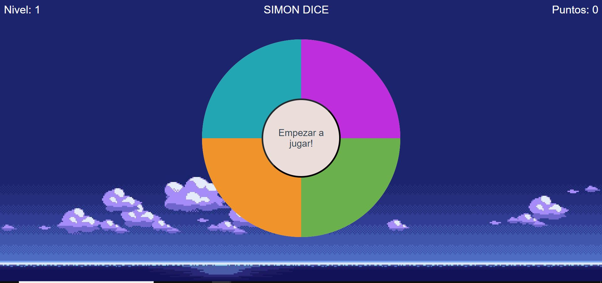

# Simon Dice 
 

Un juego muy entretenido para pasar el rato, si te sirve para un proyecto o darte ideas, adelante descargalo.

>Este juego esta desarrollado con solo Javascript siguiendo el [Curso de Fundamentos de Javascript](https://platzi.com/clases/fundamentos-javascript/) de [Platzi](https://platzi.com/)

## Demostración 
Juega: https://albertodaniel-castillo.github.io/Simon-dice/ 

## Instrucciones 
Los colores se iluminaran y se debe apretar el mismo color que se iluminó en el orden correcto. Cada vez que sube de nivel el numero de colores que se iluminan incrementa en uno. 
Nivel Final: 10

## Tecnologías 
- JavaScript
- HTML
- CSS 

## Autor 
- Alberto Daniel Castillo Mendoza

